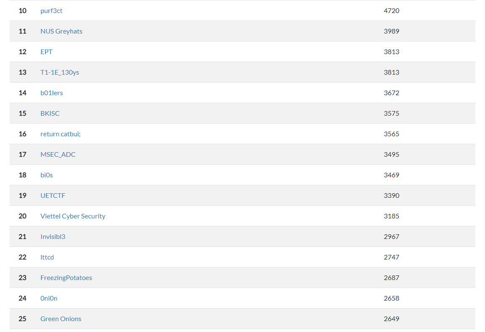

I played ISITDTU CTF 2022 Quals with my friends in HCMUS as FreezingPotatoes team and reached 23th place. I solved `pwn01` and `re-name`. Pwn-related challenges were fun, especially `pwn01` took me almost me 8 hours to figure out that I was wrong about `printf` and change the attack to abusing `rand` as we can leak everything with Format String Bug including random seed.

